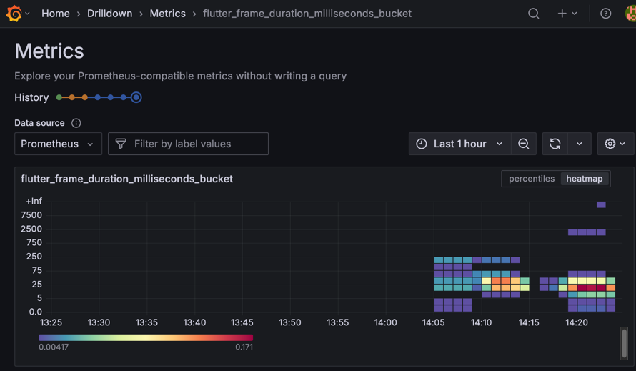
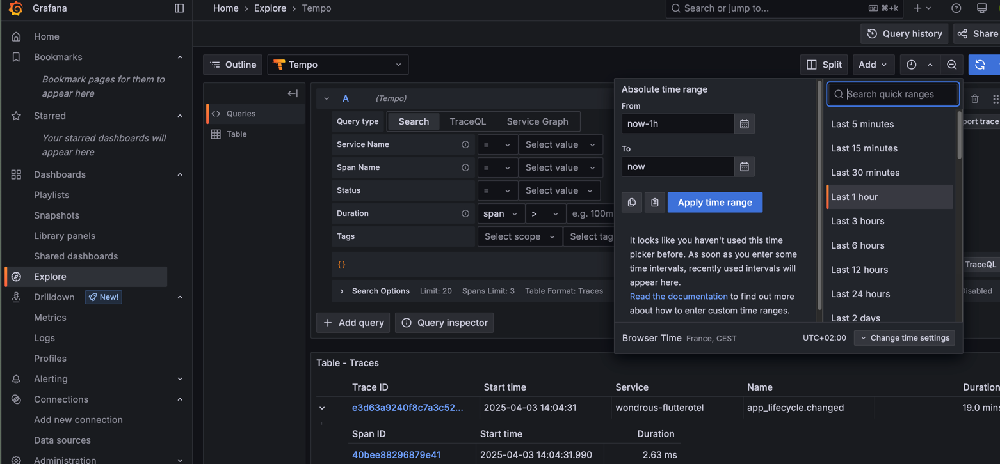

# Wonderous OpenTelemetry

This is a fork of the Wondrous app that adds OpenTelemetry
via [Flutterific OTel](https://pub.dev/flutterific_otel) and [Dartastic.io](https://dartastic.io)

This Wondrous app reports user interactions and app metrics to an OpenTelemetry backend.

This app reports startup times, Apdex scores, page rendering times, component paint times, navigations and user interactions
such as swipes and clicks on the photo grid.

This fork adds a weather widget to Wondrous to demonstrate otel traces through the backend.

## OpenTelemetry Demo

## 1. Run an otel collector

### Run otelcol binary

Most simply, [download the otelcol for your platform](https://opentelemetry.io/docs/collector/installation/),
add the otelcol binary to your path, and run `./tools/otel-demo/otelcol-demo.sh`.

This will run `otelcol` with the demo config: `tools/otel-demo/otelcol-demo-config.yaml`.

### Run Grafana via Docker

Using docker, you can run this instrumented Wondrous app against a local Grafana OpenTelemetry stack.  You'll need
Docker Desktop or similar running.  Run the following command to launch a Grafana OTel stack locally.
Go to localhost:3000 and sign in to Grafana as admin/admin.
```
docker run -p 3000:3000 -p 4317:4317 -p 4318:4318 --rm -ti grafana/otel-lgtm
```


## 2. Run Wondrous pointed at the collector

Run the Wondrous app configured to send OpenTelemetry data to the otel collector running on the localhost.
```
flutter run -d ios --dart-define WEATHER_API_KEY=3f4d6e7bf868e5d14487ff4c06466e36 --dart-define OTEL_EXPORTER_OTLP_ENDPOINT=http://localhost:4317 --dart-define OTEL_EXPORTER_OTLP_PROTOCOL=http/gRPC
```


Run this Wondrous app locally by building and running for a target platfrom such as web,
iOS, Android, etc.

Navigate around the app and you'll see Metrics (under Drilldown).




Traces can be found under Explore, Choose Tempo, a reasonable time (Last 1 hr), and for the Query Type, click Search.



Thank you to the fabulous designers and developers of Wondrous.


# Wonderous 
<p align="center">


</p>
<p align="center">
 
</p>

Navigate the intersection of history, art, and culture. Wonderous will educate and entertain as you uncover information about some of the most famous structures in the world. 

Built by [gskinner](https://gskinner.com/) in partnership with the Flutter team, Wonderous deliberately pushes visual fidelity, effects and transitions to showcase what Flutter is truly capable of on modern mobile hardware.

In addition to forking and reviewing the [MIT licensed](LICENSE) code available here, you can check out more information on the [Wonderous Showcase Website](https://wonderous.app).

# App Downloads

To try the app you can download it from your favorite app store:
* [Google Play](https://play.google.com/store/apps/details?id=com.gskinner.flutter.wonders)
* [Apple App Store](https://apps.apple.com/us/app/wonderous/id1612491897)

Or you can try it on the web at https://wonderous.app/web/

# Installation

If you're new to Flutter the first thing you'll need is to follow the [setup instructions](https://flutter.dev/docs/get-started/install).

Once Flutter is setup, you can use the latest `stable` channel:
 * `flutter channel stable`
 * `flutter upgrade`

 Once on `stable` you're ready to run the app on your local device or simulator:
 * `flutter run -d ios`
 * `flutter run -d android`

### WASM

[Wonderous](https://wonderous.app/web/) is deployed using the Web Assembly target for Flutter Web (WASM). To test WASM locally you can use the command `flutter run -d chrome --wasm`.
### Impeller Rendering

This app uses the new [Impeller Runtime](https://docs.flutter.dev/perf/impeller) by default on iOS.

# About gskinner
We build innovative digital experiences for smart clients, and we love how Flutter unleashes our creativity when building multi-platform apps. Don't hesitate to [stop by our site](https://gskinner.com/) to learn more about what we do, or check out other [innovative Flutter projects](https://flutter.gskinner.com) we've built. We'd love to hear from you!

# License

This application is released under the [MIT license](LICENSE). You can use the code for any purpose, including commercial projects.

[](https://opensource.org/licenses/MIT)
